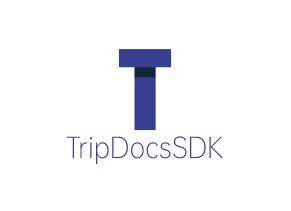

<div align="center">

<h1 style="border-bottom: none">
     <br />
    TripDocsSDK is an application  framework for Slate and React to make it easier to build modern rich text editors.
    <br>
</h1>

</div>

## TripDocsSDK | [中文版](readme.md)


<!-- MarkdownTOC -->

- [Introduction](#Introduction) 
- [Features](#Features) 
- [Screenshot](#Screenshot) 
- [Development](#Development) 
- [Production](#Production) 
- [Plugings](#Plugings) 
- [Thanks](#Thanks) 
- [Licence](#Licence)

<!-- /MarkdownTOC -->

## Introduction

 + **TripDocsSDK** is based on Ctrip internal  rich text editors kernel, refining a general, modern, stable, collaborative, and can be used for production  modern rich text editors.
 
+ At present, TripDocsSDK has integrated TripDocs system and Trippal briefing system, and iDev system is being connected. In TripDocs system, it has been running for more than 1 year and has accumulated 2000+ documents.
 
+ **TripDocsSDK** relies on slatejs, yjs and reactjs. And on the basis of slatejs, the second development  includes a lot of components and a large number of error correction mechanism, making the editor more stable and reliable.

## Features

- Support for NPM package import and CDN import.

- Provides a large number of regular plugins, on-demand selection, plug and play, without additional development costs.

- Solutions for a lot of crashes.

- Markdown editing and word parsing.

## Screenshot


## Development

```bash
# Install
npm install

# start up
npm run dev

# run 

# The startup will listen to ports 3001 and 5385

# visit

http://127.0.0.1:3001/

```

## Production

```bash


# Build the npm package
npm run buildPC 

or

# Build the cdn package
npm run buildNpm 


```


## Plugings

- [x] Undo/Redo 
- [x] Font size 
- [x] Font color 
- [x] Bold 
- [x] Italic
- [x] Strikethrough
- [x] Underline 
- [x] Alignment 
- [x] Unordered list 
- [x] Ordered list 
- [x] Task list 
- [x] Ident
- [x] Link 
- [x] Reference
- [x] Codeblock
- [x] Text and Title
- [x] Table 
- [x] Horizontal line
- [x] Clear Format
- [x] Format brush 
- [x] Toolbar 
- [x] TOC 
- [x] Shortcut key 
- [ ] Superscript 
- [ ] Subscript 
- [ ] Media - Pictures 
- [ ] Media - Video 
- [ ] Media - Audio 
- [ ] Emoji

## Thanks

Thanks for all these great efforts  making this project better.

- [Yjs](https://github.com/yjs/yjs) & [Yrs](https://github.com/y-crdt/y-crdt) -- Fundamental support of CRDTs for our implementation on state management and data sync.
- [React](https://github.com/facebook/react) -- View layer support and web GUI framework.
- [slatejs](https://github.com/ianstormtaylor/slate) -- Customizable rich-text editor.
- [antd](https://ant.design/) -- Help designers/developers building beautiful products more flexible and working with happiness
- [@emotion](https://emotion.sh/docs/introduction) -- Emotion is a library designed for writing css styles with JavaScript.
- [@codemirror](https://codemirror.net/) -- CodeMirror is a code editor component for the web.
- [html2pdf](https://github.com/eKoopmans/html2pdf.js) -- html2pdf.js converts any webpage or element into a printable PDF entirely client-side using html2canvas and jsPDF.
- [prismjs](https://github.com/PrismJS/prism) -- Lightweight, robust, elegant syntax highlighting.

## Licence

[MIT](./License.md)
